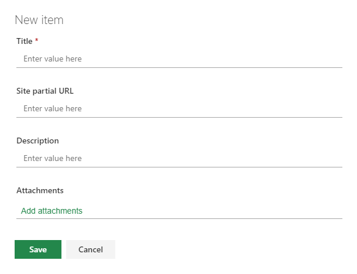
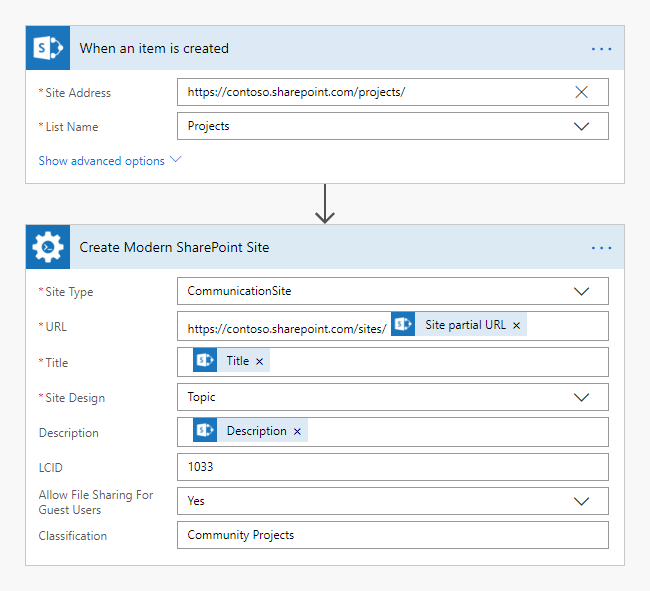

How to create a modern team or communication SharePoint site in Microsoft Flow or Azure Logic Apps
=================================================================================================

In this article, we will demonstrate how to configure a Microsoft Flow that will automatically create a new site in SharePoint on an item creation. This approach works in SharePoint Online (Office 365).

In this flow, we are using `Create Modern SharePoint site <../../actions/sharepoint-processing.html#create-modern-sharepoint-site>`_ action from `Plumasail SP connector <https://plumsail.com/actions/sharepoint/>`_, which is a part of `Plumsail Actions <https://plumsail.com/actions>`_. This action allows you to create modern team and communication sites.

When you create a modern team site there is automatically created an Office 365 group. With Office 365 Groups your team can collaborate and communicate easier using all or any of the following:

- Shared Planner for tasks management: to create new plans, organize and assign tasks, share files and chat about what you are working on
- Shared Outlook Inbox for emails and conversations
- Shared Yammer Group to chat
- Shared Outlook Calendar 
- Shared SharePoint Document Library 
- Shared OneNote Notebook 

Let us take a simple example of a project management system where an administrator creates a new list item for a project in a SharePoint list specifying a **Title**, an **URL** and a **Description** for the new project site. 

Create a modern SharePoint site
-------------------------------

Create a Projects List
~~~~~~~~~~~~~~~~~~~~~~~~~~

First of all, let us create a new *Projects* SharePoint list with the following structure:

- Title  -  A default text field. 
- Site partial URL  -  A single line text field. A partial URL for a new project site (for example, *project1* value can be used to create a subsite with an URL like this: :code:`http://yourdomain.sharepoint.com/sites/project1`)
- Description  -  A single line text field. A description of a new project.

This is how looks the form to add a list item:

Now, we are ready to create the flow.

Create a modern team site
~~~~~~~~~~~~~~~~~~~~~~~~~~

We configure a flow that starts on an item creation in *Projects* list. To do that, we just add *When an item is created* action from SharePoint connector and specify **Site Address** and **the name** of our Projects **list**.

On the next step, we add `Create Modern SharePoint site <../../actions/sharepoint-processing.html#create-modern-sharepoint-site>`_ action to the flow and use **Title**, **Site partial URL** and **Description** from the output of the previous action to specify the fields values.

This is how our flow looks like:

.. image:: ../../../_static/img/flow/how-tos/create-modern-sharepoint-site.png
    :alt: Create a modern team site

We defined our Office 365 group as public, but you can choose to make the group private so others in your organization can not see inside it.

We simplified this example to keep it clear. You may add more fields to the projects list to work with your projects. For example, you can add fields **Classification** or **Is Public** to use this information in the action.

Create a modern communication site
~~~~~~~~~~~~~~~~~~~~~~~~~~

You may use a similar approach to create communication sites with help of  the same `Create Modern SharePoint site <../../actions/sharepoint-processing.html#create-modern-sharepoint-site>`_ action.

Please see an example of a configured flow below:

Conclusion
-------------------

That is it. These few simple steps can help you to manage your company's projects more effectively.

.. hint::
  You may also be interested in `this article <https://plumsail.com/docs/actions/v1.x/flow/how-tos/sharepoint/create-site-by-custom-template-and-grant-permissions.html>`_ explaining how to Create SharePoint site by a custom template and grant permissions in Microsoft Flow and Azure Logic Apps.

