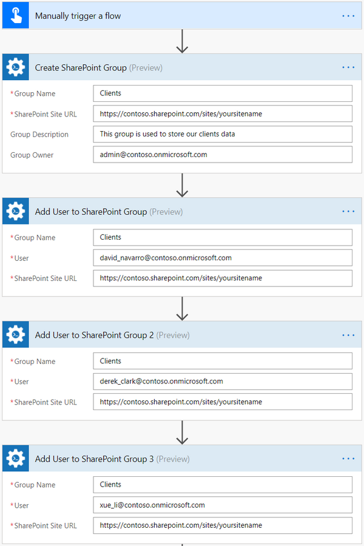
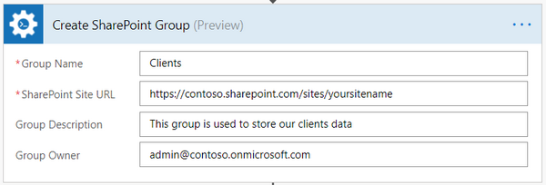
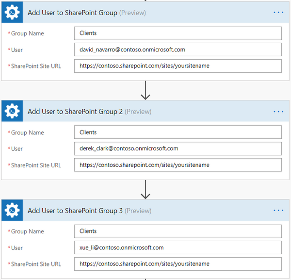
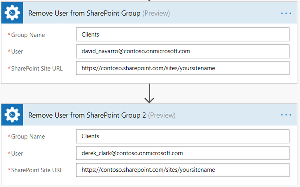

How to create SharePoint group and add users in Microsoft Flow and Azure Logic Apps
===================================================================================

In this article, you will learn how to create a SharePoint group and add users there. 
Let us suppose that you have created a new site and now you want to create a group and add users there. 
We will be using `Create SharePoint Group`_ and `Add User to SharePoint Group`_ actions from `Plumsail SharePoint connector`_.

There are a few other actions to manage SharePoint groups which you can use in your flow:

- Create SharePoint Group
- Update SharePoint Group Properties
- Remove SharePoint Group
- Add User to SharePoint Group
- Is User Member of SharePoint Group
- Get Members of SharePoint Group
- Remove User from SharePoint Group

You can find all the actions and their description on `this page`_.

Create Microsoft Flow
~~~~~~~~~~~~~~~~~~~~~
Now let us review the flow and learn how it is implemented:

|flow|

You can actually pick any trigger. For example, you can start a flow when a new email arrives. We are using "Manually trigger a flow" trigger here to simplify the flow.

Create SharePoint Group
~~~~~~~~~~~~~~~~~~~~~~
`Create SharePoint Group`_ is the action from `Plumsail SharePoint connector`_. You can use it to create groups in your SharePoint.

|create-sp-group-action|

You can specify this group’s owner and add a description.

Add users to SharePoint group
~~~~~~~~~~~~~~~~~~~~~~~~~~~~~
Now we are adding users to the newly created group. We are using `Add User to SharePoint Group`_ action from `Plumsail SharePoint connector`_ to do this.

|add-users|

Remove User from SharePoint Group
~~~~~~~~~~~~~~~~~~~~~~~~~~~~~~~~~
Sometimes we also need to remove users from a SharePoint group. In this case, we can use `Remove User from SharePoint Group`_ action from `Plumsail SharePoint connector`_.

|remove-users|

Conclusion
~~~~~~~~~~
Now you should have an idea how to use the actions from `Plumsail SharePoint connector`_ for Microsoft Flow to manage SharePoint groups. 
If you haven’t used the connector yet, `registering an account`_ would be the first step. It is quite easy to get started.

.. _Create SharePoint Group: ../../actions/sharepoint-processing.html#create-sharepoint-group
.. _Add User to SharePoint Group: ../../actions/sharepoint-processing.html#add-user-to-sharepoint-group
.. _Plumsail SharePoint connector: https://plumsail.com/actions/sharepoint/
.. _this page: ../../actions/sharepoint-processing.html
.. _Remove User from SharePoint Group: ../../actions/sharepoint-processing.html#remove-user-from-sharepoint-group
.. _registering an account: ../../../getting-started/sign-up.html

