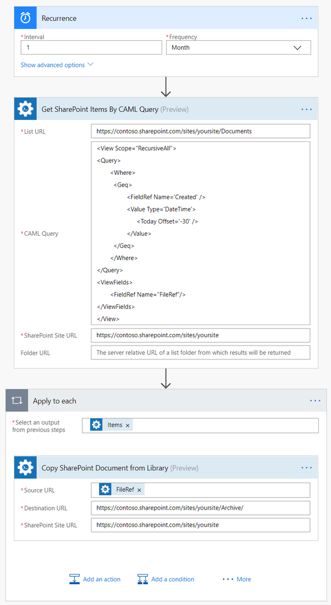
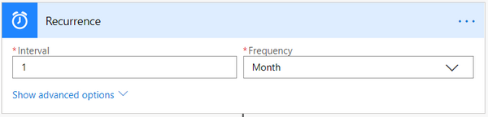
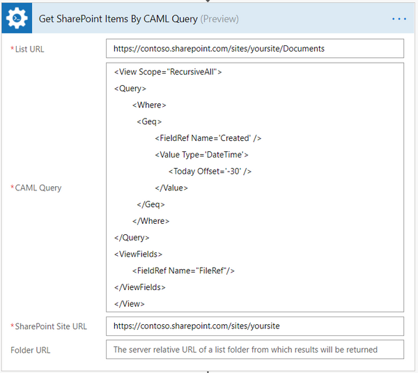
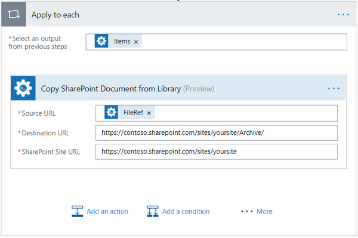

How to get items from SharePoint lists and libraries using CAML query in Microsoft Flow
=======================================================================================
In this article, you will learn how to get documents from a SharePoint document library. 
In this example, we will archive documents that were created for the past 30 days once a month in your SharePoint using Microsoft Flow. 
We will use `Get SharePoint Items By CAML Query`_ action from `Plumsail SharePoint connector`_.

Let us suppose that we have a folder in SharePoint with documents and we want to archive only those that were created for the past 30 days, we also want to schedule this flow to run every month. 
You can also use this action to work with lists and items.

You can use a trigger in your flow instead of running the flow with a specific timing, for example, standard SharePoint or Outlook triggers.

You might have seen this error in MS Flow: “The field ‘FieldName’ is not supported in query. The lookup list is in another web”. Right now MS flow crashes when trying to query list items with a cross-site lookup in it. 
There are also other restrictions on reading some fields with the help of standard MS flow action that uses REST. 
In this case, our action that allows you to get items by CAML query works better.

Create Microsoft Flow
~~~~~~~~~~~~~~~~~~~~~
Now let us review the flow and learn how it is implemented:

|flow|

Flow trigger
~~~~~~~~~~~~
We are using Recurrence trigger to run the flow once a month.

|flow-trigger|

Get SharePoint Items By CAML Query action
~~~~~~~~~~~~~~~~~~~~~~~~~~~~~~~~~~~~~~~~~
`Get SharePoint Items By CAML Query`_ is the action from `Plumsail SharePoint connector`_. You can use it to get various information about items or documents by using CAML query.

|flow-get-items-using-CAML-action|

In this CAML query, we are receiving the documents that were created for the past 30 days and we are also getting “FileRef” field from these documents that we will use later in the flow.

Let us review the query in details. We are using <Geq> condition which means “Great or equal”. Then we are getting “Created” field of every document. 
After that, we are getting today’s date and making an offset for 30 days back. The query compares these dates and it gets all the documents that fit the conditions above.

“FileRef” stores relative path to a file. We will need this path later in the flow. We need to specify the field that we want to receive between <ViewFields> tag so we could use it as a variable.

.. code:: html

  <View Scope="RecursiveAll">
  <Query>
    <Where>
      <Geq>
        <FieldRef Name='Created' />
        <Value Type='DateTime'>
        <Today Offset='-30' />
        </Value>
      </Geq>
    </Where>
  </Query>
  <ViewFields>
          <FieldRef Name="FileRef"/>
  </ViewFields>
  </View>

Copy SharePoint Document from Library action
~~~~~~~~~~~~~~~~~~~~~~~~~~~~~~~~~~~~~~~~~~~~
Now we need to copy the documents that we received information about. We are using `Copy SharePoint Document from Library`_ action from `Plumsail SharePoint connector`_. 

|flow-copy-document-action|

We are iterating through all the items from the previous action in a cycle and copying it to “Archive” folder in our SharePoint. 
Please notice how we are using “FileRef” variable, it specifies the relative path to the current document automatically.

Conclusion
~~~~~~~~~~
Now you should have an idea how to use `Get SharePoint Items By CAML Query`_ action from `Plumsail SharePoint connector`_ for Microsoft Flow. 
If you haven’t used it yet, `registering an account`_ would be the first step. It is quite easy to get started.

.. _Get SharePoint Items By CAML Query: ../../actions/sharepoint-processing.html#get-sharepoint-items-by-caml-query
.. _Plumsail SharePoint connector: https://plumsail.com/actions/sharepoint/
.. _Copy SharePoint Document from Library: ../../actions/sharepoint-processing.html#copy-sharepoint-document-from-library
.. _registering an account: ../../../getting-started/sign-up.html

