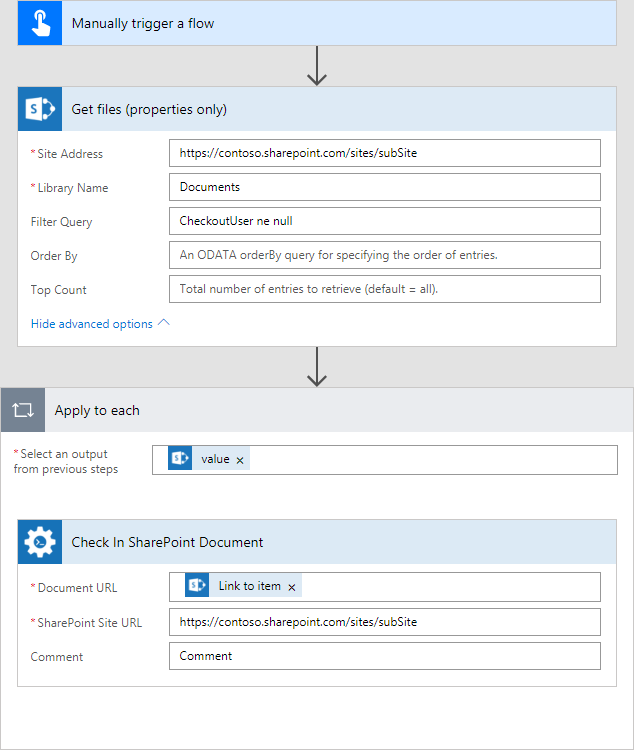
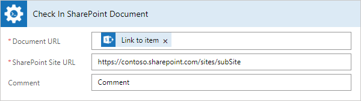

How to check-in multiple SharePoint documents
===============================================

This article will show how to check-in multiple documents using Microsoft Flow. 

For example, we have a situation where during a day people work with documents in SharePoint Document library. To work with some document a user takes it to work and mark it as check-out, but at the end of the day, every document should be checked-in back.

For this case, I will use *‘Get files (properties only)‘* from SharePoint Connector for getting properties of documents that need to be checked-in and *‘Check In SharePoint Document‘* from Plumasail SP connector, which is a part of `Plumsail Actions <https://plumsail.com/actions>`_ for each document that will found on the firts step.

Before starting, ensure that you `added Plumsail SP connector to Microsoft Flow <../../../getting-started/use-from-flow.html>`_.

Below you can find an example of a small flow that gets all documents in check-out status and does check-in for each one:

Manually trigger a flow
------------------------

For this case, I'm using the trigger to manual start of the flow.

.. _getFilesProperties:

Get files (properties only)
------------------------------

.. image:: ../../../_static/img/flow/how-tos/sharepoint/get-files-preporties-check-in.png
   :alt: Get Files Preporties

On this step, I get all documents in check-out status:

*‘Site Address‘* as :code:`https://contoso.sharepoint.com/sites/subSite` - The URL of the site. 

*‘Library Name‘* as :code:`"Documents"` - The name of the source folder.

The action is using `OData filter <http://www.odata.org/documentation/odata-version-3-0/url-conventions/>`_ as a value of *‘Filter Query‘* field. I compare "CheckOutUser" field from document's properties with the null value. If the value of this field is not equal null then that is mean this file has check-out status.

Check In SharePoint Document
-----------------------------

This action is using in "each" cycle that based on results of :ref:`getFilesProperties` action.

As value for *Document URL‘* I'm using the value of *‘Link to item‘* parameter from *‘Get files (properties only)‘* response:

*‘SharePoint Site URL‘* I specified as :code:`"https://contoso.sharepoint.com/sites/subSite"` - The URL of the site.

*‘Comment‘* as :code:`"Comment"` - The comment to accompany document check in.

Conclusion
-----------

That's all! These few simple steps can help ease the work with documents for users.