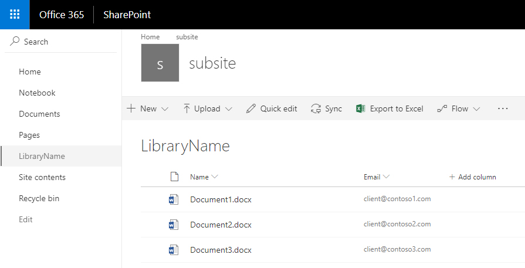
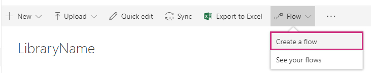
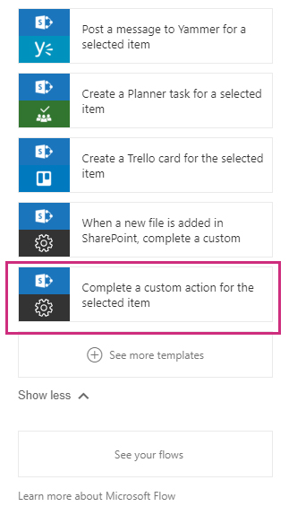
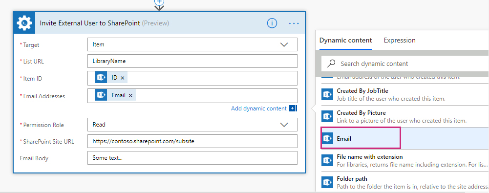
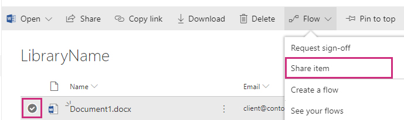

How to share a SharePoint document with external users in Microsoft Flow and Azure Logic Apps
===================================================================================

In this article, we will demonstrate how to share SharePoint documents with external users with help of Microsoft Flow. This approach works in SharePoint Online (Office 365).

Let us imagine the following use case: there is created a contract in a SharePoint library on our site and we want to send the document for a review to a customer (an external user). 

We added an additional column **Email** to  the documents library to store information about customers emails. We will use this information to send invitations to the clients. This is how our document library looks like:

We are going to create a flow that will simplify invitation process. To do it we click **Flow**, **Create a flow**:

Then we pick **Complete a custom action for the selected item** template in the list of template on the right:

We proceed to **Compling a custom action for the selected item** and simply add to the flow *Invite External User to SharePoint* actions from `Plumasail SP <https://plumsail.com/actions/sharepoint/>`_ connector:

.. image:: ../../../_static/img/flow/how-tos/invite-user-to-an-item.jpg
    :alt: Completed flow

We set up the Target field as **Item**, fill in the Library Name, pick **ID** variable from Get Items section on the right side to fill in the Item ID field and **Email** variable to fill in the Email Addresses field:

The flow is ready. To start it on a particular document go to the library, **select a document**, click **Flow**, **pick and run the flow**:

Conclusion
-----------

That is it. These few simple steps can help you to ease communication with your clients.

.. hint::
  You may also be interested in `this article <https://plumsail.com/docs/actions/v1.x/flow/how-tos/sharepoint/how-to-share-SharePoint-sites.html>`_ explaining how to share SharePoint sites with external users in Microsoft Flow and Azure Logic Apps.

