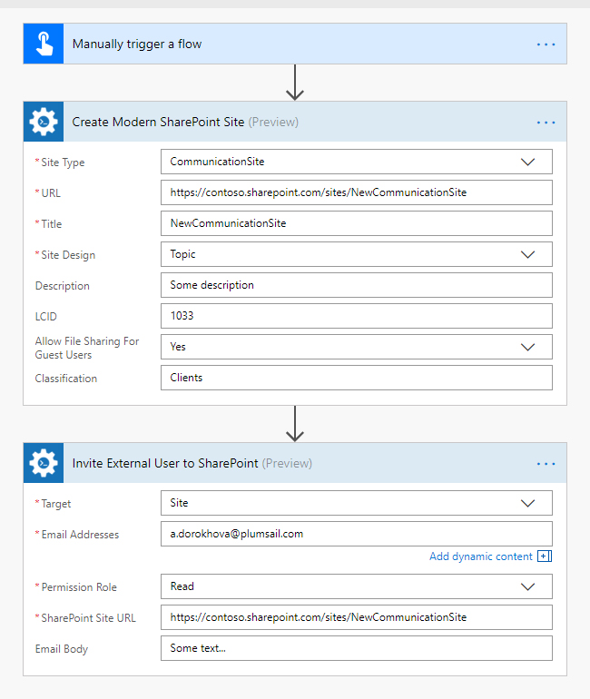
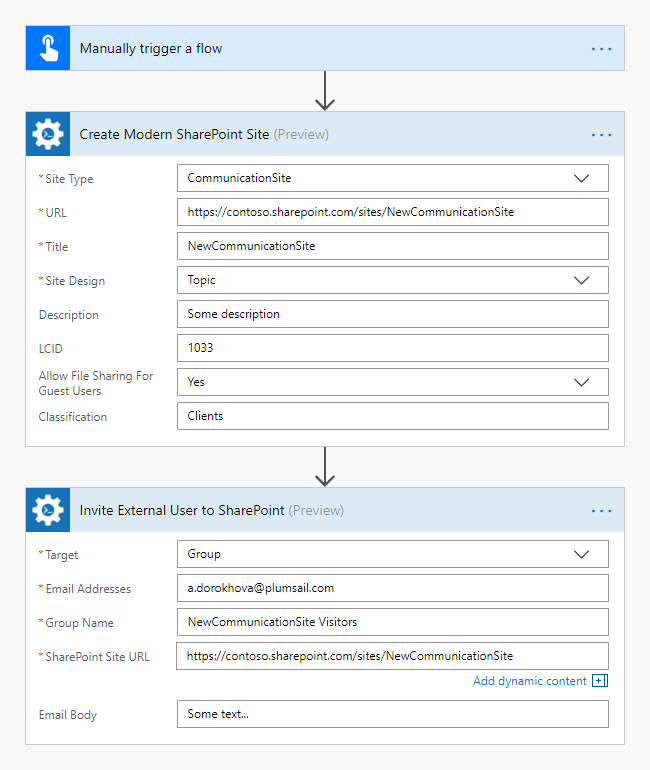

How to share a SharePoint site with external user in Microsoft Flow and Azure Logic Apps
===================================================================================

In this article, we will demonstrate how to create a Modern SharePoint site and share it with external users with help of Microsoft Flow. This approach works in SharePoint Online (Office 365).

Let us imagine the following use case: we create a new project site and need to provide access to customers (external users) to it. 

We will use *Create Modern SharePoint Site* and *Invite External User to SharePoint* actions from Plumasail SP connector, which is a part of `Plumsail Actions <https://plumsail.com/actions>`_.

This is how our complete flow will look like:

Trigger a flow
~~~~~~~~~~~~~~~~~~~~~~~~~~~~~~

You can actually pick any trigger. For example, you can start Flow on an item creation in a SharePoint list. We use *Manually trigger a flow* trigger here to simplify the Flow.

Create Modern SharePoint Site
~~~~~~~~~~~~~~~~~~~~~~~~~~~~~~

As we want to focus on communicating a message to a wide audience, we choose the Communication site type for our new site. We choose **Topic** template to customized the home page, set up locale identifier (LCID) as **1033** (English language) and allow file sharing for guest users.

Invite External Users to SharePoint
~~~~~~~~~~~~~~~~~~~~~~~~~~~~~~

We specify the target of the operation as a Site, enter the URL of the newly created site and set up the permission role as **Read**. We added an email manually to the email addresses field, but you can get information about email addresses dynamically and specify multiple emails using semicolon as delimiter.

That is all, the flow is configured.

You may also use an alternative approach, where you can add external user to a SharePoint group that has access to site instead of adding users directly to the site:

On the last step n the screenshot above, we add the uses into an automatically created Visitors group that has **Read** permissions level.

Conclusion
-----------

That is it. These few simple steps can help you to ease communication with your clients.

.. hint::
  You may also be interested in `this article <https://plumsail.com/docs/actions/v1.x/flow/how-tos/sharepoint/how-to-share-SharePoint-documents.html>`_ explaining how to share SharePoint documents with external users in Microsoft Flow and Azure Logic Apps.