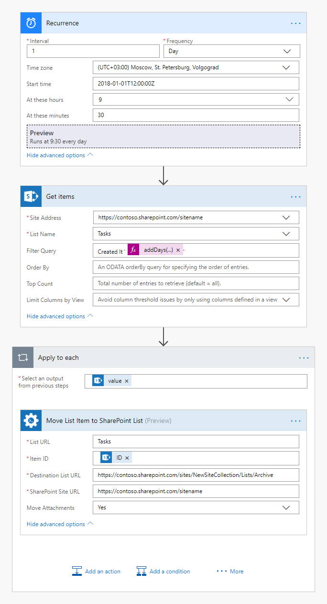
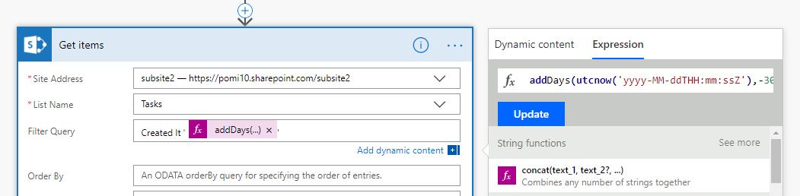

How to copy or move SharePoint list items with attachments cross-site in Microsoft Flow or Azure Logic Apps
===========================================================================================================================

In this article, we will demonstrate how to archive SharePoint list items with help of Microsoft Flow. This approach works in SharePoint Online (Office 365).

Let us imagine the following use case: We have a list of tasks with attachments. There is another list in another site collection to archive tasks. We want to move all tasks older than 30 days to this archive list.

I will show how to use `Move List Item to SharePoint List action <../../../flow/actions/sharepoint-processing.html#move-list-item-to-sharepoint-list>`_, but it works the same way for `Copy List Item to SharePoint List action <../../../flow/actions/sharepoint-processing.html#copy-list-item-to-sharepoint-list>`_. These actions are from `Plumasail SP connector <https://plumsail.com/actions/sharepoint/>`_, which is a part of `Plumsail Actions <https://plumsail.com/actions>`_.

This is how our complete flow will look like:

Configure Microsoft Flow:
------------------------

Below, we will guide you step by step through creating the flow.

Schedule flow to start every day
~~~~~~~~~~~~~~~~~~~~~~~~~~~~~~~~~~

We schedule our flow to start every day at 9:30 AM Moscow time. You can choose any recurrence.

Query all tasks older than 30 days
~~~~~~~~~~~~~~~~~~~~~~~~~~~~~~~~~~

On this step, we specify the  site, the list name, get items and filter them on the creation date.

In this scenario, we want to filter out new items and only get items that have the created date that is more than 30 days old. To accomplish this we use a flow expression that will calculate the date, 30 days ago. We will then look for any item that has a **Created** date that is less than this date. 

The complete expression is: **Created lt 'addDays(utcnow('yyyy-MM-ddTHH:mm:ssZ'),-30)'**. In this scenario, **Created** is our source field, **lt** represents our 'less than' operator and **addDays(utcnow('yyyy-MM-ddTHH:mm:ssZ'),-30)** will calculate a date of 30 days prior.

As the output, we only have items that are more than 30 days old.

Move the queried items in a loop
~~~~~~~~~~~~~~~~~~~~~~~~~~~~~~~~~~

We proceed to the last step and simply add to the flow `Move List Item to SharePoint List action <../../../flow/actions/sharepoint-processing.html#move-list-item-to-sharepoint-list>`_ actions from `Plumasail SP connector <https://plumsail.com/actions/sharepoint/>`_.

We click **Item ID** field and add there item **ID** from a menu on the right. This will automatically transform this action into repeating one which will be performed for each file from the source folder.

We specify the Destination **list name**, **list URL** as well as **SharePoint Site URL** to define the context of the action. 

In the end, we also click *Show advanced options* and pick **Yes** to move the items with the attachments.

Conclusion
------------------------

That is it. These few simple steps can help ease the work with tasks for users. The flow will start every day at 9:30 AM and old tasks will be automatically moved to the archive list in another site collection.

