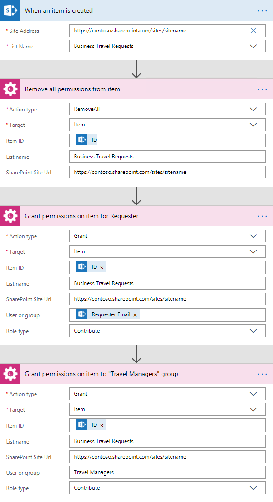

Set item level permissions (break role inheritance and assign permissions)
############################################################################

This article will show how to use Microsoft Flow to break role inheritance and grant permissions on the list item for the user and for specific SharePoint group.

This example will show a simple case of business traveling system when a user can create a new request on the business travel as the item in SharePoint list (*‘Business Travel Requests‘*), specify the requester of the business trip the locations of his business trip, the date of departure and the date of return. 
Once it is done, the flow breaks the permissions inheritance for the new item and grant permissions for the user that was specified as the requester and for *‘Travel Managers‘* SharePoint group that contains managers who response for business trips.

This article is divided to stages:

- :ref:`createList`
- :ref:`configureFlow`

.. _createList:

Create SharePoint list
----------------------
At this stage it was created the new SharePoint list *‘Business Travel Requests’*  with following structure:

* Requester – "Person or Group" field. The user who requests a business trip.
* Date of Departure – "Date and Time" field. The date of beginning a business trip.
* Date of Return - "Date and Time" field. The date of ending a business trip.
* Location - Text field. The destination of a business trip.

This is how the new form looks like:
 
.. image:: ../../../_static/img/flow/how-tos/set-permissions-list-new-item.png
   :alt: Create site

.. _configureFlow:

Configure Microsoft Flow
-----------------------------
At this stage was created a flow and configured it to start on list item creation for *‘Business Travel Requests’* list.

You can find more information about specific parameters of the flow actions in `the documentation <https://plumsail.com/docs/actions/v1.x>`_ .

The complete flow is below:

As you can see I used *‘When an item is created’* trigger from *‘SharePoint’* connector and three *‘Change Permissions’* actions.

When an item is created
++++++++++++++++++++++++

At this step I specify values for *‘Site Address’* and *‘List Name’* fields to bind the flow to the *‘Business Travel Requests‘* list.

Remove all permissions from item
++++++++++++++++++++++++++++++++++

It is a *‘Change Permissions’* action.

In this action, I firstly choose *‘RemoveAll’* value for *‘Action type’* field and *‘Item’* value for *‘Target’* field.

Then others fields of the form generated automatically based on my parameters.

After that, I specified value of *‘Item ID‘* field as *‘ID‘* parameter from *‘When an item is created‘*, *‘List name’* as the name of my list with business travel requests (*‘Business Travel Requests‘*) and specify the URL of the site as the value for *‘SharePoint Site URL‘* field.

Grant permissions on item for Requester
++++++++++++++++++++++++++++++++++++++++

It is another *‘Change Permissions’* action for granting permissions on the new item for user that was specified as the requester.

In this action, I firstly choose *‘Grant’* value for *‘Action type’* field and *‘Item’* value for *‘Target’* field.

Then others fields of the form generated automatically based on my parameters.

After that, I specified value of *‘Item ID‘* field as *‘ID‘* parameter from *‘When an item is created‘*, *‘List name’* as the name of my list with business travel requests (*‘Business Travel Requests‘*) and specify the URL of the site as the value for *‘SharePoint Site URL‘* field.
Next, I specified *‘Role type‘* field as *‘Contribute’* and the value of the parameter *‘Requester Email’* from *‘When an item is created‘* as the value of *‘User or group’* field. Also, I specified the URL of the site as the value for *‘SharePoint Site URL‘* field.

Grant permissions on item to "Travel Managers" group
+++++++++++++++++++++++++++++++++++++++++++++++++++++++

It is another *‘Change Permissions’* action for granting permissions on the new item for *‘Travel Managers‘* SharePoint group that contains managers who response for business trips.

In this action, I firstly choose *‘Grant’* value for *‘Action type’* field and *‘Item’* value for *‘Target’* field.

Then others fields of the form generated automatically based on my parameters.

After that, I specified value of *‘Item ID‘* field as *‘ID‘* parameter from *‘When an item is created‘*, *‘List name’* as the name of my list with business travel requests (*‘Business Travel Requests‘*) and specify the URL of the site as the value for *‘SharePoint Site URL‘* field.
Next, I specified *‘Role type‘* field as *‘Contribute’* and the name of the group *‘Travel Managers’*as the value of *‘User or group’* field. Also, I specified the URL of the site as the value for *‘SharePoint Site URL‘* field.

That is all, the flow is configured.

.. hint:: You are may using the actions for setting variables with your site URL and the name of the list and then use it in Plumsail Actions in *‘SharePoint Site URL‘* and *‘List Name‘* fields for more convenient using of actions.