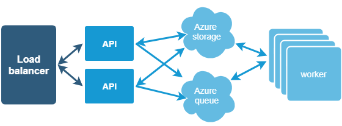
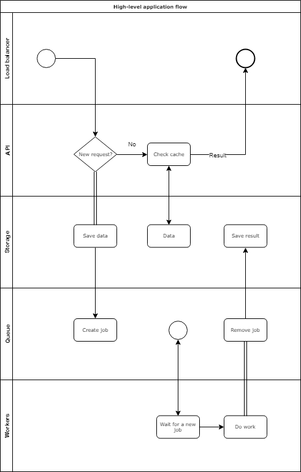
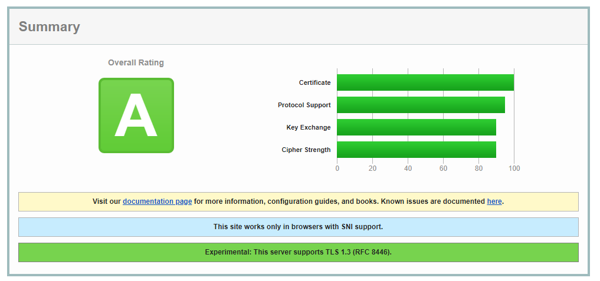

Architecture
############

High-level architecture
-----------------------

During the designing process, our goal was to build a scalable, resilient, and highly available product. 

The core component of this architecture is a web front end (API) that serves client requests, checks authentication and creates new jobs in Azure Queue. 
The workers perform resource-intensive tasks like document conversion and so on. 

The web front end communicates with the worker through a message queue. 
It allows us independently upgrade and scale the services without any downtime. 

Application flow
----------------

We use Haproxy as a load balancer, it distributes requests across our backends, also it constantly does health checks and can switch the load to a healthy/backup server if something went wrong.

Our API service is written on dotnet core, it serves requests, does required authentication checks, creates a new job in Azure Queue for future processing and contains some logic for calculation billing. 
Also, it checks storage and returns a result when it is ready. 

We use Azure Storage as a transit storage, all other components are stateless. We have a services jobs that clean up the storage periodically. 
We use Azure Queue to notify background workers that there is available some work for them. A message will be removed from the storage only if it was processed. It was done to guarantee resiliency.

We are using a few servers with background workers which work in parallel. The workers are stateless. They process all tasks. If some worker fails, the job will be processed by another. 

Security architecture 
---------------------

We are using Microsoft Azure as a cloud hosting provider.
All our servers are located in West Europe region. 
All data is encrypted in transit through Transport Layer Security (TLS)

The data stored in Azure Storage is encrypted `by default`_.

Related documents: 

* `Azure SOC 1 Report <../_static/files/general/security/azure-soc-1-type-2-report-2017-10-01-to-2018-9-30.pdf>`_  
* `Azure SOC 2 Report <../_static/files/general/security/azure-soc-2-type-2-report-2017-10-01-to-2018-9-30.pdf>`_  
* `Azure SOC 3 Report <../_static/files/general/security/azure-soc-3-report-2017-10-01-to-2018-9-30.pdf>`_

.. _by default: https://azure.microsoft.com/sv-se/blog/announcing-default-encryption-for-azure-blobs-files-table-and-queue-storage/
