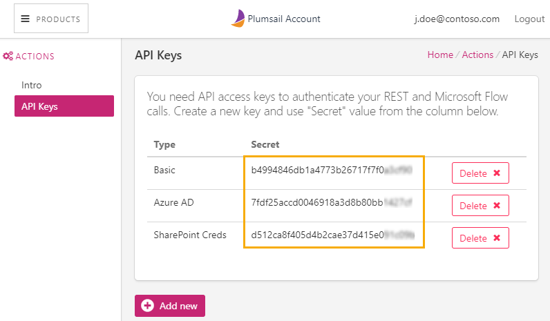

Register account and get API key
=======================================

First of all, you need to `register Plumsail Account <https://auth.plumsail.com/account/Register?ReturnUrl=https://account.plumsail.com/documents/intro/reg>`_. This account is used to manage your Plumsail products including Plumsail Documents.

If you already have an account, just sign in to `account.plumsail.com <https://auth.plumsail.com/account/login?returnUrl=https://account.plumsail.com/documents/intro>`_.

Then you need to navigate to the "API Keys" section and click "Add new".

Once you created an API key, you can see your key right in the "Secret" column. You can also change a name of a key by clicking on it in the "Name" column:

Copy your secret key and use it in:

- `Microsoft Flow <use-from-flow.html>`_
- `REST API calls <use-as-rest-api.html>`_