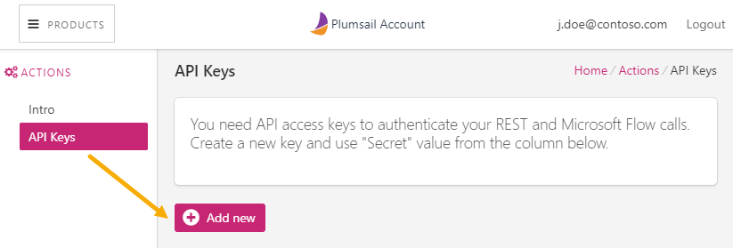

Register account and get API key
=======================================

Register account
----------------

First of all, you need to `register Plumsail Account <https://auth.plumsail.com/account/Register?ReturnUrl=https://account.plumsail.com/actions/intro>`_. This account is used to manage Plumsail Actions and Plumsail Forms products.

It is better to use your active email address. The subscription will be linked to this address.

If you already have an account, just sign in to `account.plumsail.com <https://auth.plumsail.com/account/login?returnUrl=https://account.plumsail.com/actions/intro>`_.

Generate API key
----------------

Once you registered your account, navigate to the "API Keys" section. You will see your key right in the "Secret" column.

Now you can use your new API Key in:

- `Microsoft Flow <use-from-flow.html>`_
- `REST API calls <use-as-rest-api.html>`_