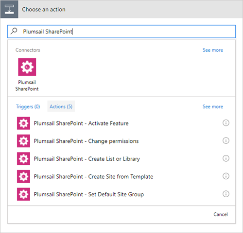

Use in Microsoft Flow
=======================================

Pick right connector
--------------------

There are two connectors available in Plumsail Actions:

- `Plumsail Documents connector <../flow/actions/document-processing.html>`_ - provides a set of actions for operations with Documents.
- `Plumsail SharePoint connector <../flow/actions/sharepoint-processing.html>`_ - provides a set of actions for operations with SharePoint.

.. important:: 

  If you use *'Plumsail SharePoint'* connector, `you need to add it manually <../flow/create-custom-connector.html>`_. It is not available in the global directory yet. 

  It is not required for *'Plumsail Documents'* connector.

Create your first Flow
----------------------

Then you can search for "Plumsail" in you Flow and add appropriate action:

When you add an action for the first time you will be asked for *'Connection Name'* and for *'Access Key'*. You can type any name for the connection. For example, *'Plumsail SharePoint'*. 

Then `create an API key in your Plumsail Account page <sign-up.html>`_ and paste it to *'Access Key'* input. 

.. note:: There are different types of keys for different connectors. You need to copy an API key for the particular connector.

.. image:: ../_static/img/getting-started/sp-create-flow-connection.png
   :alt: Screen of Plumsail Actions

Examples of Flows
-----------------

Once you clicked *'Create'* you can use Plumsail Actions in your Microsoft Flows. Review *'Microsoft Flow examples'* to learn how to use them:

.. toctree::      
      :name: toc-microsoft-flow-examples
      :maxdepth: 2
            
      ../flow/how-tos/sharepoint/index
      ../flow/how-tos/documents/index