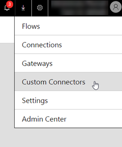
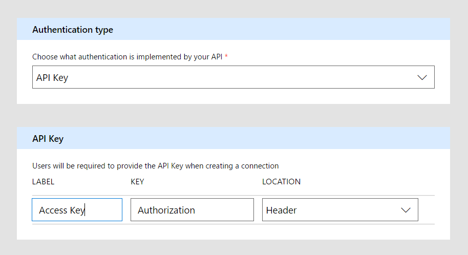
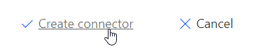
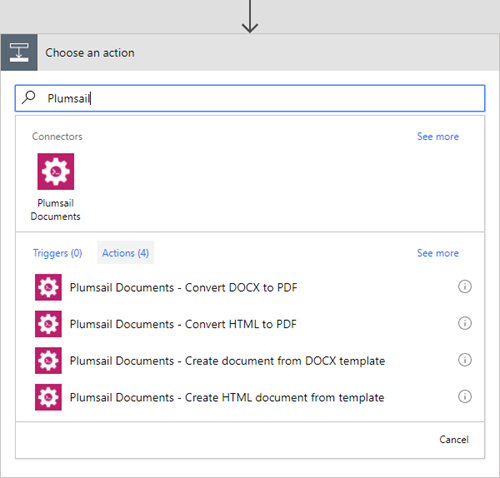

Use in Microsoft Flow
=======================================

.. note:: You will need an API key that you can `create in your Plumsail Account page <sign-up.html#generate-api-key>`_.

Add custom connector
--------------------

First of all, you need to add a custom connector to Microsoft Flow. Open Microsoft Flow account then navigate to *'Custom Connectors'* and click add:

Fill in swagger definition URL:

::

  https://api.plumsail.com/swagger/DocumentsFlow/swagger.json

After click *'Continue'*, you should see authentication type screen:

Fill in *'Label'* with the value *'Access Key'* and click *'Create connector'*:

Create your first flow
----------------------

Once you added a connector, the new actions will be available in your flows:

When you add an action for the first time you will be asked for *'Connection Name'* and for *'Access Key'*. 

You can type any name for the connection. For example, *'Plumsail Documents'*. Then copy and paste API key that you `create in your Plumsail Account page <sign-up.html#generate-api-key>`_ to *'Access Key'* input.

.. image:: ../_static/img/getting-started/create-flow-connection.png
   :alt: Screen of Plumsail Actions

Once you clicked *'Create'* you can use Plumsail Actions in your Microsoft Flows. Review *'Microsoft Flow examples'* section in `the root of documentation <../index.html>`_.