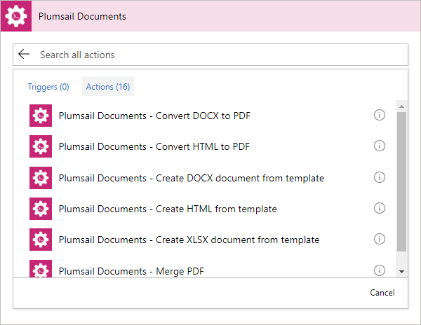
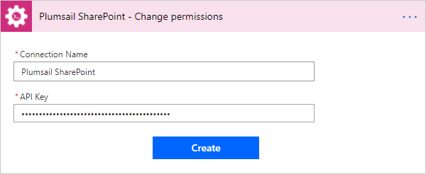

Use in Microsoft Flow
=======================================

Find `Plumsail Documents <https://emea.flow.microsoft.com/en-us/connectors/shared_plumsail/plumsail-documents/>`_ in the list of available Microsoft Flow connectors. Then you can search for "Plumsail" in you Flow and add appropriate action:

When you add an action for the first time you will be asked for *'Connection Name'* and for *'Access Key'*. You can type any name for the connection. For example, *'Plumsail Documents'*. 

Then `create an API key in your Plumsail Account page <sign-up.html>`_ and paste it to *'Access Key'* input. 

Examples of Flows
-----------------

Once you clicked *'Create'* you can use Plumsail Documents in your Microsoft Flows. Review *'Microsoft Flow examples'* to learn how to use them:

.. toctree::      
  :name: toc-microsoft-flow-examples
  :maxdepth: 2 
        
  ../flow/how-tos/sharepoint/index
  ../flow/how-tos/documents/index