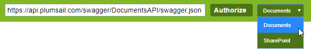
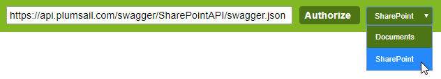

REST API Reference
==================

There are two APIs available in Plumsail Actions. You can learn how to use them `here <../getting-started/use-as-rest-api.html>`_. Reference for each API is below:

Document processing API reference
---------------------------------

Navigate to `this link <https://api.plumsail.com/swagger>`_ and pick "Documents" at the top right corner:

SharePoint processing API reference
-----------------------------------

Navigate to `this link <https://api.plumsail.com/swagger>`_ and pick "SharePoint" at the top right corner:

