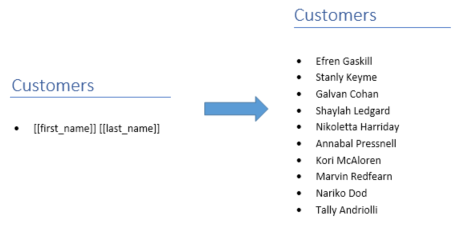
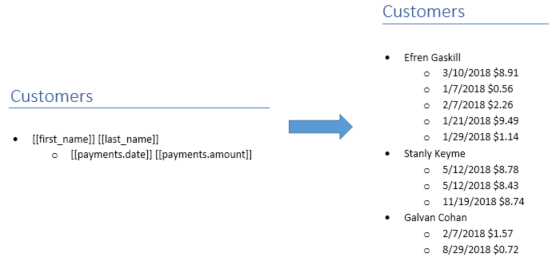
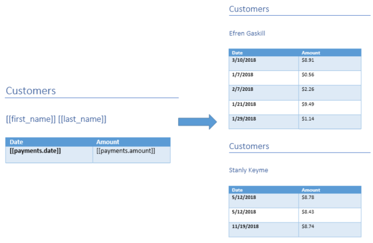

Create a simple document
========================

Basic syntax
-------------

To specify token you need to surround it with double square brackets::

    Hello [[first_name]]

To work  with arrays you need to know that our template engine is smart enough to understand the object and replicate current block:: 

    Payments: 
    * [[payments.amount]]

Let’s dive in and have a look at some examples. 
We will work with the following data set:: 

        [
            {
                "id": 1,
                "first_name": "Efren",
                "last_name": "Gaskill",
                "email": "egaskill0@opensource.org",
                "gender": "Male",
                "photo": "https://robohash.org/omnisquiquo.jpg?size=50x50&set=set1",
                "birth_date": "8/20/1985",
                "payments": [
                {
                    "date": "3/10/2018",
                    "amount": "$8.91"
                },
                {
                    "date": "1/7/2018",
                    "amount": "$0.56"
                },
                {
                    "date": "2/7/2018",
                    "amount": "$2.26"
                },
                {
                    "date": "1/21/2018",
                    "amount": "$9.49"
                },
                {
                    "date": "1/29/2018",
                    "amount": "$1.14"
                }
                ]
            }
        ]

Simple data binding
--------------------

Nested data binding
--------------------

Tables
--------------------

It the example we have got duplicated Customers header, to understand why this was happen, we need to explain term - *Context*. 
*Context* - it is a block of the document related to current item. 
*Context* can be the whole document (like in the example), a single row in a table or item in a list. 
*Context* can be a lot more complex, for example multiple rows in a table, nested range inside nested range, etc.

We are creating a new context when paste content in a table, for example we can insert our data to table with one cell without borders

.. image:: ../../_static/img/template-engine/tables-binding-context.png
   :alt: binding data to tables with new context

Try by yourself
--------------------

Please try to play around with the template by yourself 

    * `subscriptions.json <../../_static/files/template-engine/customers.json>`_
    * `simple-document.docx <../../_static/files/template-engine/simple-document.docx>`_
    * `simple-document-result.docx <../../_static/files/template-engine/simple-document-result.docx>`_
