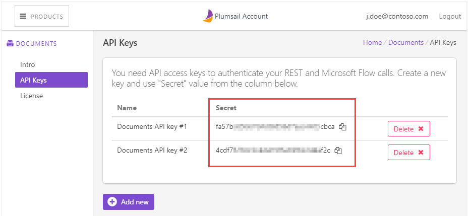

API Keys
=========================

API keys page contains all created API keys. API key is needed to authenticate your  `Microsoft Flow calls <../getting-started/use-from-flow.html>`_ or `REST <../getting-started/use-as-rest-api.html>`_.

Once you created an API key, you can see your key right in the "Secret" column. You can also change a name of a key by clicking on it in the "Name" column:

Create as many keys as you need, for example, for using with different Microsoft Flow accounts. If you don't need a key anymore you can delete it, please make sure that the key is not used anymore.