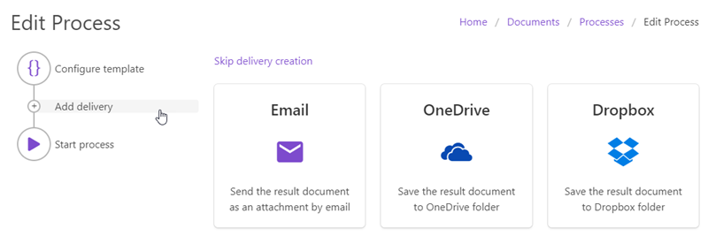

Deliver generated documents
===========================

Once your document is generated you may want to save it somewhere or send it to somebody. That is where deliveries can help. You can save the result document to OneDrive, Dropbox, send it by email, etc.

Click the "Add delivery" button on the left side of your process. You will see the list of available deliveries:

Create as many deliveries as you need. For example, you may want to save the document to OneDrive and then send it as an email message attachment.

List of available deliveries
----------------------------

Use the links below to learn more about each delivery:

.. toctree::   
  :name: toc-deliveries  
  :maxdepth: 1
    
  deliveries/send-email
  deliveries/one-drive
  deliveries/dropbox

.. Note:: 

  Once you finished configuration you can `start your process <start-process.html>`_.

  Also, You can `use Microsoft Flow <../../getting-started/use-from-flow.html#start-process-from-flow>`_ to handle documents generated by your process instead of deliveries or together with deliveries.