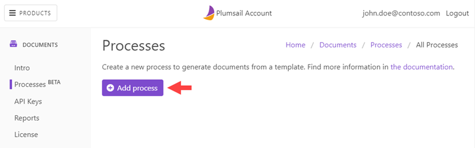
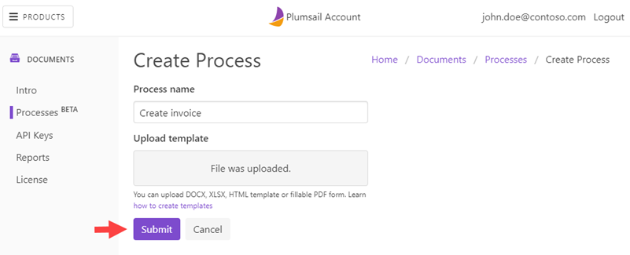
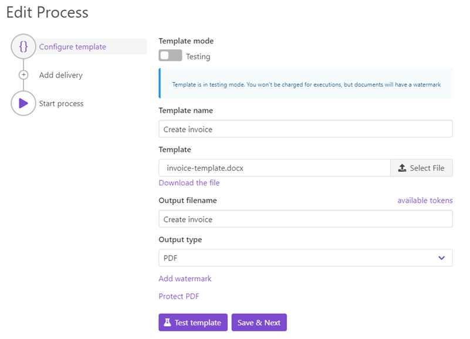
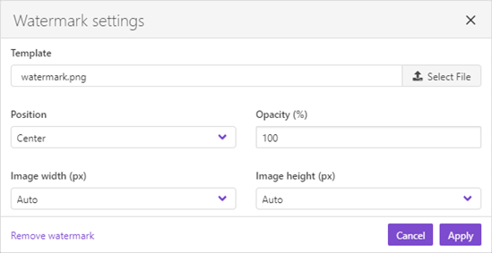
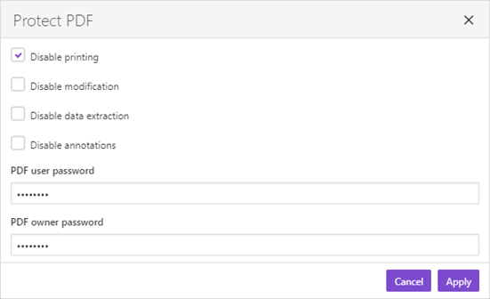

Create a new process
====================

Once you `created a document template <create-template.html>`_ you can create a new process. Navigate to `Processes <https://account.plumsail.com/documents/processes>`_ section of your account and click "Add process":

Fill in the process name and upload your template. In this article we will use `DOCX template for invoice <../../_static/files/user-guide/processes/invoice-template.docx>`_. Then click "Submit" button:

Configure template
------------------

When process is created you will see the first step of your process. It is called "Configure template":

The step has a few settings:

- :ref:`Mode <process-mode>`
- :ref:`process-name`
- :ref:`template`
- :ref:`output-filename`
- :ref:`output-type`
- :ref:`add-watermark`
- :ref:`protect-pdf`

Once you finished configuration you can `test the template <test-template.html>`_.

.. _process-mode: 

Mode
~~~~

It is "Testing" by default. It means you won't be charged for executions of this process but result documents will have a Plumsail watermark. Change it to "Active to remove the watermark.

.. _process-name:

Process name
~~~~~~~~~~~~

It is the name of your process.

.. _template:

Template file
~~~~~~~~~~~~~

File of your template. If you want to change the template, upload it here. Read `this article <create-template.html>`_ for more information about creating a template. You can download current template file by clicking "Download the file".

.. _output-filename:

Output filename
~~~~~~~~~~~~~~~

Filename of the result document. You can use tokens inside the

- :code:`{{@date}}` - Full date with time.
- :code:`{{@date}:format(dd.MM.yyyy hh:mm)}` - Formatted date.
- :code:`{{FieldName}}` - Or reference data submitted to process.

.. _output-type:

Output type
~~~~~~~~~~~

Type of the output file. By default it is the same as your template but you can change it to PDF.

.. _add-watermark:

Add watermark
~~~~~~~~~~~~~

You can see this option if you selected PDF as an output type. Click on the "Add watermark" and upload PNG image for watermark. You will see the watermark configuration dialog:

There are a few settings that you can change:
- Position - It specifies how to align the watermark on a page. By default it will be centered.
- Opacity - It is a number from 0 to 100 that specifies opacity in percents.
- Image width - It is width of image. Use it if you want to change width of a watermark image.
- Image height - It is width of image. Use it if you want to change width of a watermark image.

.. _protect-pdf: 

Protect PDF
~~~~~~~~~~~

You can see this option if you selected PDF as an output type. It allows you to protect your PDF by setting password, disabling printing, etc. Just click on the "Protect PDF" link and specify settings you need:

