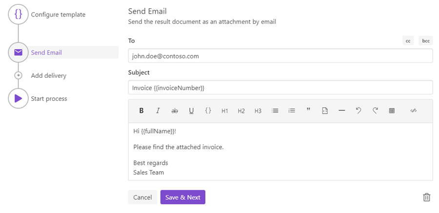

Email delivery
==============

The Email delivery sends a file generated by your process as an email attachment. This is how the email delivery step looks:

Here is the list of fields of this delivery:

- **To** - 
- **Cc** - 
- **Bcc** - 
- **Subject** - 
- **Body** - 

Use tokens inside any field in this delivery.