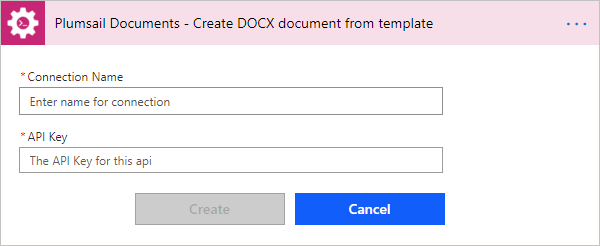

You can use `Plumsail Documents connector <https://emea.flow.microsoft.com/en-us/connectors/shared_plumsail/plumsail-documents/>`_ for Microsoft Flow to start a process. Start from `creating an API key <../user-guide/api-keys.html>`_. You will need it in your flow.

Then add the `Start process <#>`_ action to your flow. You will be asked for *'Connection Name'* and for *'Access Key'*. You can type any name for the connection. For example, *'Plumsail Documents'*. Then paste API key that you created earlier to *'Access Key'*.

Optionally, once the action is executed you can get the result document as an output of the action and continue to work with it in your flow.

Here is an example of a simple flow that starts a process and then uploads it to OneDrive:

[Picture of Flow]

Review other examples of Microsoft Flows:

.. toctree::      
  :name: toc-processes-flow-examples
  :maxdepth: 1

  ../../flow/how-tos/documents/index-create-documents-from-template    
  ../../flow/how-tos/documents/index-integrations
  ../../flow/how-tos/documents/index-E-signature 