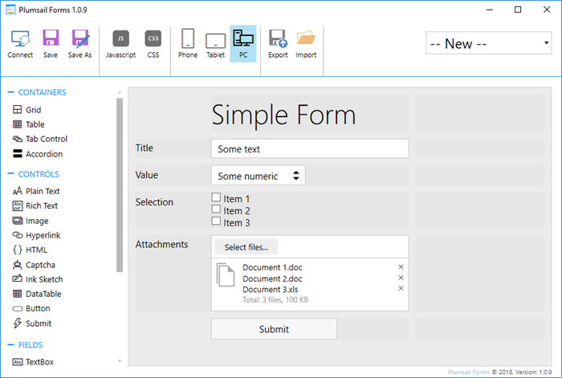
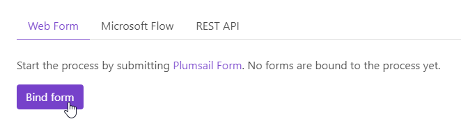
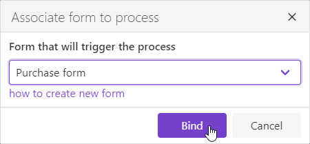
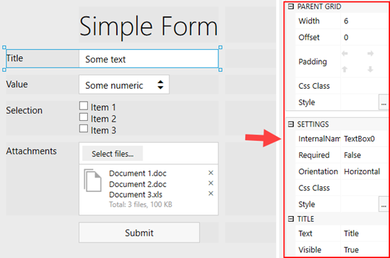
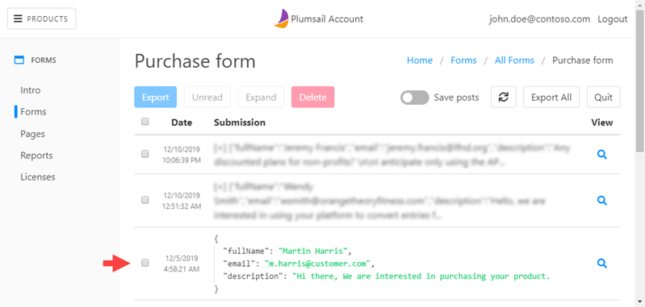

Web form
========

.. contents:: Table of contents
  :local:

Introduction
------------

You can start your process by submitting public `Plumsail Form <https://plumsail.com/forms/>`_. It is another our product that allows you to design forms using drag and drop user inteface.

This is how designer of forms looks:

.. Note:: Learn more about public Plumsail Forms in our `documentation <https://plumsail.com/docs/forms-web/introduction.html>`_ and `start designing forms <https://plumsail.com/docs/forms-web/design.html>`_.

Bind form to process
--------------------

Once you created your first form you can associate it with your process. The process will be started after each form submission. Just click "Bind form" button:

Then select the form you created earlier in the dialog:

You can bind a few forms to the same process. All of them will start the process.

Understand structure of data sent by form
-----------------------------------------

The form sends JSON data to process when it is submitted. This data will be applied to your template. It is crucial to understand structure of this JSON object to craete correct document template.

Each of control and field that you added to your form has internal name. This internal name will represent value from control of field in the JSON object. You can change it in designer like this:

You can see full JSON object submitted by form in `form submissions <https://account.plumsail.com/forms/forms>`_. Just click on your form and expand any of items:

Use properties from this JSON object when `creating your template <create-template.rst>`_.

.. note:: Also, you can start process using `Microsoft Flow <start-process-ms-flow.html>`_ or `REST API <start-process-rest-api.html>`_.