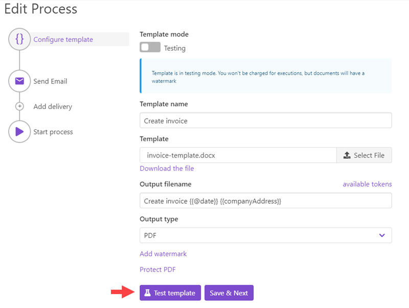
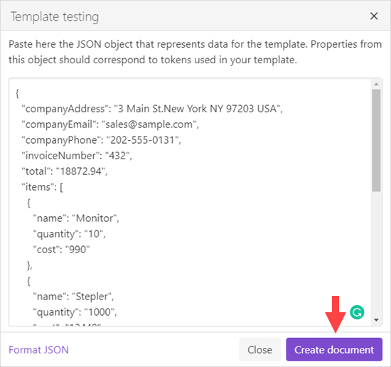

Test the template with your data
================================

Once you `created a new process <create-process.html>`_ and configured a template you can test it with your data. Just click the "Test template" button in the left bottom corner of the "Configure template" step:

You will see the dialog where you can put your data in JSON format:

Just click "Create document" to apply this data to your template. The resulting document will be downloaded automatically.

Once you tested the template you can configure `how to deliver the result document <create-delivery.html>`_ (email, OneDrive, etc). Just click the "Save & Next" button in the "Configure template" step.