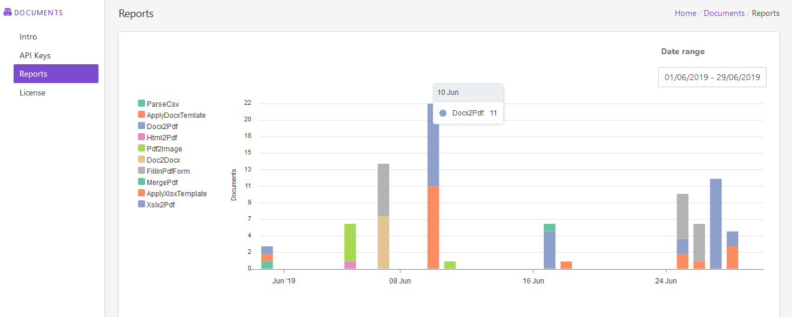
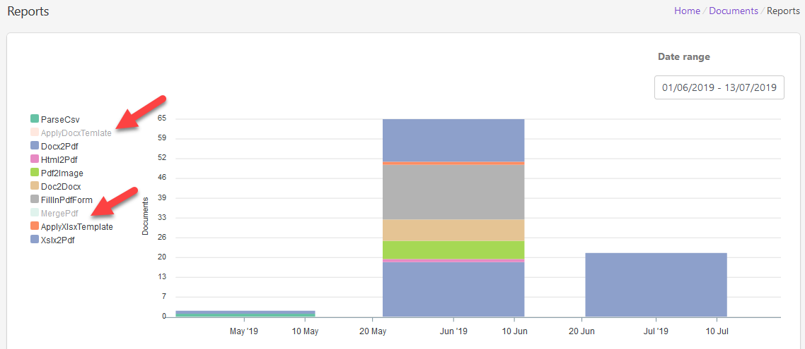

Reports
=========================

You can find usage statistic on the Reports page. It allows selecting specific interval or a single day.
Reports show statistic for all Documents actions by default but you can disable some actions if it's needed.

